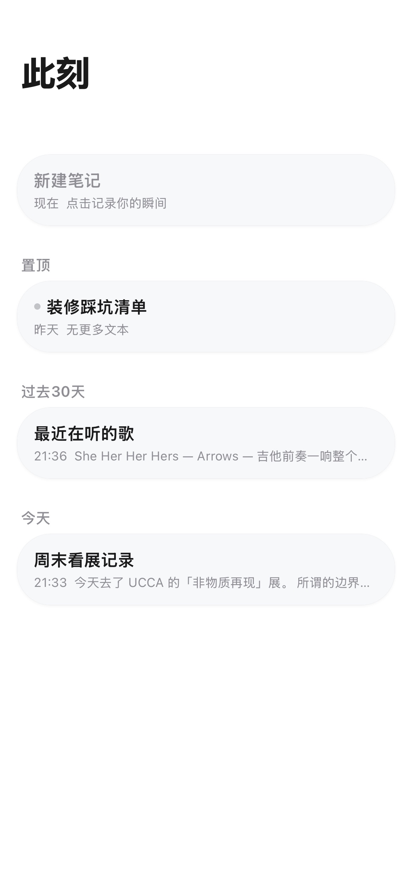

# 此刻

一个在 iOS 上好用的本地笔记。打开就能写，不用联网，不用注册账号。

<p align="center">
  
  
  
</p>

---

## 这 app 跟别的笔记有什么不一样

市面上笔记工具很多，但「此刻」的出发点不太一样。

**它不是 Notion 的简化版，也不是 Bear 的替代品。** 它是另一种思路：

| 大多数笔记工具 | 此刻 |
|---|---|
| 先选一个模板 / 建一个页面 / 取一个标题，然后才能开始写 | 点开直接写，没有「新建」流程 |
| 工具栏、菜单栏、排版引擎铺满屏幕 | 一个空的 contentEditable，输入 `/` 或 `#` 自然发现功能 |
| 数据存在厂商服务器、需要账号、担心哪天服务关闭 | 数据存在你自己浏览器的 IndexedDB 里，一份纯本地文件 |
| 离线是「功能」，需要手动开启或有限制 | 离线是默认状态。全部依赖本地化（React、marked、DOMPurify 都打包在本地） |
| 为了跨平台牺牲 iOS 细节 | 全面适配 safe-area、毛玻璃、squircle 圆角——盯着 iOS 一个平台做 |
| Markdown 编辑和预览分开两个面板 | 编辑器里直接渲染，点一下渲染块就能切回编辑，不必来回切视图 |
| 粘贴一个链接 → 显示纯文本 URL | 粘贴音乐链接 → 自动变成带封面的音乐卡片（支持网易云音乐 / QQ 音乐 / Spotify）。粘贴普通 URL → 自动抓取标题、封面图和摘要（约 2-3 秒加载） |

**简单说：** 它更像一个「能自动美化你写的东西的本地记事本」，而不是一个「需要你学习怎么用的笔记系统」。

---

## 长什么样

**看着像 iOS 原生应用，不是那种「一眼网页」的感觉。**

- 菜单和弹层全部毛玻璃效果，跟 iOS 控制中心一个质感
- 卡片圆角用了 squircle 连续曲率，比普通 border-radius 更柔和
- 标题随着滚动从大标题平滑缩成居中药丸，类似 Apple Music
- 深色模式完整支持，跟随系统
- 刘海、灵动岛、底部横条都适配好了
- 状态栏位置有渐变遮罩，内容滚动时不会突兀
- 极简配色：纯白/纯黑底，0.5px 细线代替分割线

---

## 怎么用

**触屏为主，键盘为辅。**

- **三指撤销/重做** — iOS 原生手势，左滑撤销、右滑重做。外接键盘 Cmd+Z/Shift+Cmd+Z
- **列表左滑** — 划出「置顶」和「删除」，动画跟手
- **斜杠命令** — 编辑器里打 `/` 出命令面板，支持拼音首字母搜索（`bt` → 标题、`tp` → 图片）
- **智能前缀** — 输入 `# ` 变标题、`> ` 变引用、`[ ] ` 变待办、`---` 变分割线，回车即转换
- **卡片防误触** — 链接卡片左右边缘 24px 内不响应跳转
- **图片取色** — 列表卡片自动从首张图片提取主色调做底色

---

## 可以玩什么

**它不是「写完了就放着」的工具，有些东西还挺好玩。**

- **拼积木一样的块** — 段落、图片、音乐卡片、待办、画廊混搭，组合出丰富的页面
- **内联装饰** — `==高亮==` `~~删除线~~` `!!注意` `??疑问` `@@提及` `$标签$` `#话题#`，输入完自动渲染好
- **Callout 提示块** — `> [!NOTE]` `> [!WARNING]` `> [!TIP]` 五种风格，写注意事项很好看
- **装饰分割线** — `---🌟---` 产生带 emoji 的分割线
- **彩色标签** — `$red:重要$` 或 `$蓝色标签$` → 彩色药丸
- **Emoji 快捷** — `:smile:` → 😊，30+ 常用
- **卡片彩蛋** — 粘贴网易云音乐 / QQ 音乐 / Spotify 链接 → 自动变成带封面的音乐卡片（约 2-3 秒加载显示封面和标题）；粘贴普通网址 → 自动抓取标题和摘要；粘贴纯图片 URL → 自动变成图片块。全部粘贴即触发，无需手动操作

---

## 适合谁

- 想要启动快的笔记工具，不想等加载
- 笔记散落在各个平台，想集中到一个地方
- 经常在没信号的地方需要记东西
- 不信任厂商锁定数据，想要本地优先、随时能导出的工具
- 觉得 Notion 太重、备忘录太简陋，中间缺一个刚好的

---

## 功能一览

**编辑器：**
段落 / 标题 H1-H3 / 待办 / 引用 / 分割线 / 装饰分割线 · 音乐卡片 / 链接卡片 / 图片卡片 / 图文卡片 / 图文行 / 图片画廊 · 斜杠命令 20+ / 拼音搜索 / 智能前缀 · Markdown 自动渲染（表格 / Callout / 代码块 / 列表）· 撤销/重做（三指 / 键盘 / 菜单）

**存储：**
IndexedDB 主存 + localStorage 备份 · Google Drive 云备份（覆盖/合并）· ZIP 导出/导入（含附件）

**列表：**
时间分组 · 置顶 · 图片缩略图自动提取 · 标签自动提取 · 展开/折叠

**个性化：**
字号三档 · 8 种笔记背景色 · 自定义笔记头像

---

## 技术栈

React 18（UMD，无构建工具）· contentEditable · IndexedDB + localStorage · Cloudflare Worker（链接抓取）· fflate / marked / DOMPurify · **所有依赖本地化，无运行时 CDN**

```
Moments.html  +  src/（模块） +  vendor/（依赖）
```

---

## 隐私

没有跟踪、没有 Cookie、没有第三方分析。笔记存在你的浏览器里。云备份只有你主动用时才会发到你的 Google Drive。

---

## License

MIT
